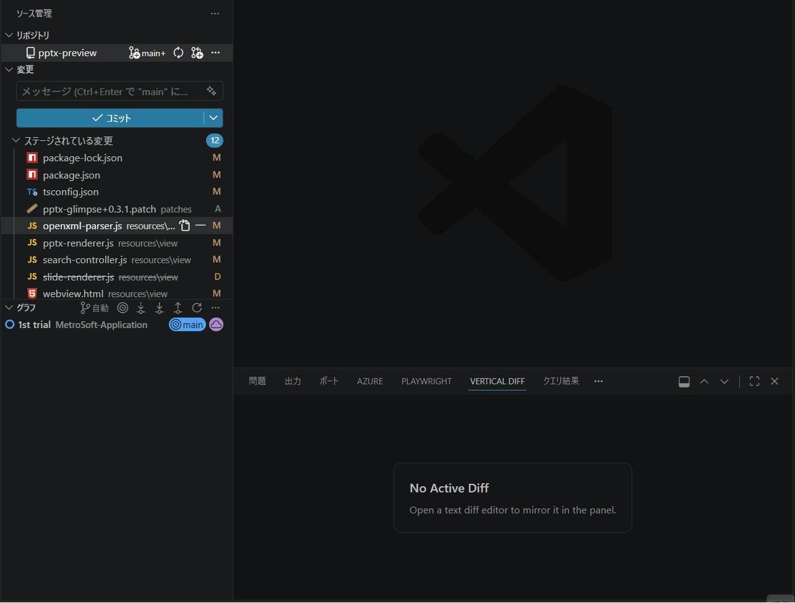

# Vertical Diff

Shows the active VS Code diff in a stacked panel.

## Features

- Original on top, modified below
- Aligned rows for easier comparison
- Line and inline change highlighting
- Follows the active diff automatically
- Move to the previous or next change
- Placeholder view for large or unsupported content

## Usage

### Move between changes

1. Open a diff.
2. Use the toolbar or run **"Vertical Diff: Previous Change"** and **"Vertical Diff: Next Change"**.

## Requirements

- Visual Studio Code 1.85.0 or later
- An active text diff

## Settings

- `verticalDiff.fontSize`: Panel font size. Set `0` to follow `editor.fontSize`.

## Notes

- Read-only panel view
- The first automatic open may move focus
- Large or unsupported content is shown as a placeholder

## License

Licensed under MIT